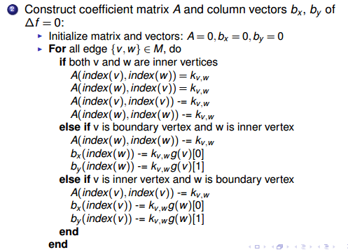
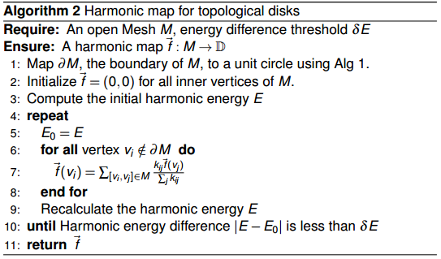
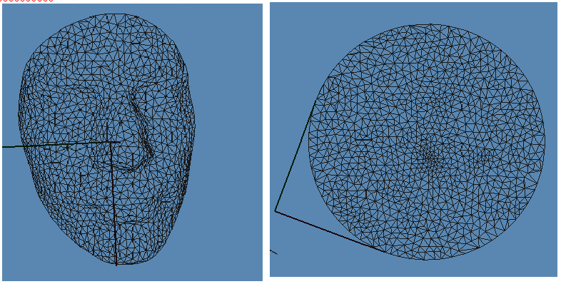
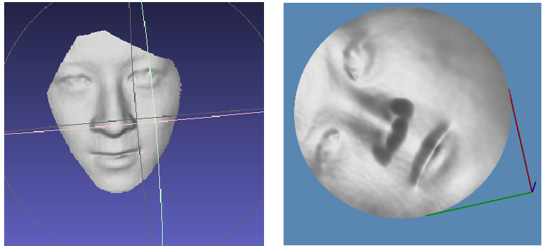
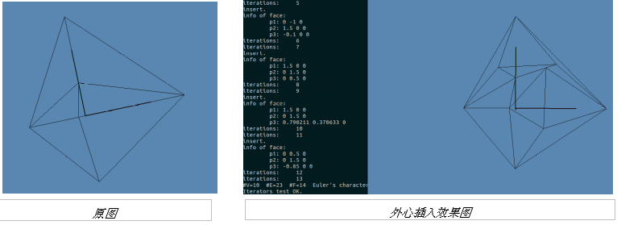
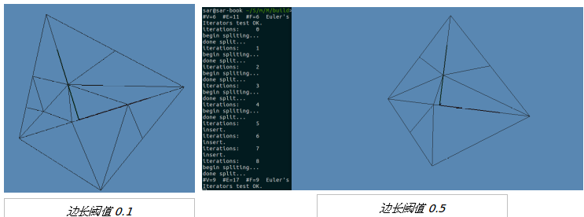
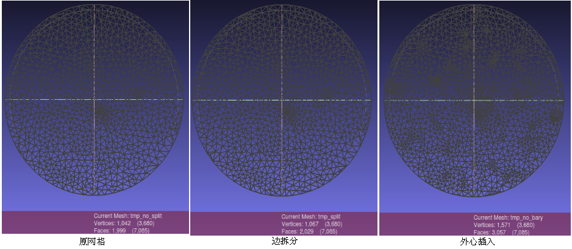

# MyDemo
1.切换到build目录下，使用命令：           cmake ..
2.在build目录下，使用命令：               make
3.运行程序(这里运行数据文件为face.m)      ./MyDemo ../../Data/face.m 

## Laplace Solution

```c++
void _map() 
    {
        //fix the boundary
        _set_boundary();

        std::vector<Eigen::Triplet<double> > A_coefficients;
        std::vector<Eigen::Triplet<double> > B_coefficients;

        
        //set the matrix A
        for( CMyMesh::MeshVertexIterator viter( m_pMesh ); !viter.end(); ++ viter )
        {
            CMyVertex * pV = *viter;
            if( pV->boundary() ) continue;
            int vid = pV->idx();

            double sw = 0;
            for( CMyMesh::VertexVertexIterator witer( pV ); !witer.end(); ++ witer )
            {
                CMyVertex * pW = *witer;
                int wid = pW->idx();
                
                CMyEdge * e = m_pMesh->vertexEdge( pV, pW );
                double w = e->weight();

                if( pW->boundary() )
                {
                    Eigen::Triplet<double> e(vid,wid,w);
                    B_coefficients.push_back( e );
                }
                else
                {
                    A_coefficients.push_back( Eigen::Triplet<double>(vid,wid, -w) );
                    //A_coefficients.push_back( Eigen::triplet<double> e(vid,wid,-w) );
                }
                sw += w;
            }
            //A.insert( vid, vid) = sw;
            A_coefficients.push_back( Eigen::Triplet<double>(vid,vid, sw ) );
        }


        Eigen::SparseMatrix<double> A( m_interior_vertices, m_interior_vertices );
        A.setZero();

        Eigen::SparseMatrix<double> B( m_interior_vertices, m_boundary_vertices );
        B.setZero();
        A.setFromTriplets(A_coefficients.begin(), A_coefficients.end());
        B.setFromTriplets(B_coefficients.begin(), B_coefficients.end());


        Eigen::ConjugateGradient<Eigen::SparseMatrix<double>> solver;
        solver.compute(A);
        
        if( solver.info() != Eigen::Success )
        {
            std::cerr << "failed" << std::endl;
        }


        for( int k = 0; k < 2; k ++ )
        {
            Eigen::VectorXd b(m_boundary_vertices);
            //set boundary constraints b vector
            for( CMyMesh::MeshVertexIterator viter( m_pMesh ); !viter.end(); ++ viter )
            {
                CMyVertex * pV = *viter;
                if( !pV->boundary() ) continue;
                int id = pV->idx();
                b(id) = pV->huv()[k];
            }

            Eigen::VectorXd c(m_interior_vertices);
            c = B * b;

            Eigen::VectorXd x = solver.solve(c);
            if( solver.info() != Eigen::Success )
            {
                std::cerr << "failed" << std::endl;
            }

            //set the images of the harmonic map to interior vertices
            for( CMyMesh::MeshVertexIterator viter( m_pMesh ); !viter.end(); ++ viter )
            {
                CMyVertex * pV = *viter;
                if( pV->boundary() ) continue;
                int id = pV->idx();
                pV->huv()[k] = x(id);
                // pV->point()[k] = x(id); 
            }

        }

        for( CMyMesh::MeshVertexIterator viter( m_pMesh ); !viter.end(); ++ viter )
        {
            CMyVertex * pV = *viter;
            if( pV->boundary() ) continue;
            pV->huv()[2] = 0;
            // pV->point()[k] = x(id);   
        }
        std::cout << "map done...\n";

```
## Reducing Harmonic Enegy

```c++
void _iterative_map( double threshould = 5e-4 )
    {
        //fix the boundary
        _set_boundary();

        //move interior each vertex to its center of neighbors
        for( CMyMesh::MeshVertexIterator viter( m_pMesh ); !viter.end(); ++ viter )
        {
            CMyVertex * pV = *viter;
            if( pV->boundary() ) continue;
            
            pV->huv() = CPoint(0,0,0);
        }
        
        int i = 0;
        while( true )
        {
            std::cout << "iteration: " << ++i << "\n";
            double error = -1e+10;
            //move interior each vertex to its center of neighbors
            for( CMyMesh::MeshVertexIterator viter( m_pMesh ); !viter.end(); ++ viter )
            {
                CMyVertex * pV = *viter;
                if( pV->boundary() ) continue;
                
                double  sw = 0;
                CPoint suv(0,0,0);
                for( CMyMesh::VertexVertexIterator vviter(pV); !vviter.end(); vviter ++ )
                {
                    CMyVertex * pW = *vviter;
                    CMyEdge   * pE = m_pMesh->vertexEdge( pV, pW );
                    double w = pE->weight();
                    sw += w;
                    suv = suv + pW->huv() * w;
                }
                suv /= sw;
                double verror = (pV->huv()-suv).norm();
                error = (verror > error )?verror:error; 
                pV->huv() = suv;
            }
            if( error < threshould ) break;
        }
    }
```
**results:(test on Ubuntu-16.04)**





## 二维网格优化
### 1. 采用外心插入法:
当检测到当前face的最小角小于阈值（这里是0.6）时，若外心在mesh上，插入该三角形的外心，否则不作变化。
* 计算最小角
* 计算外心
* 外心插入



### 2. 采用边拆分法
当检测到当前face的最小角小于阈值（0.6）时，找到该三角形的最长边，若该边长度大于阈值（关于阈值的计算后面(5)作说明）使用EdgeSplit（边拆分）


### 效果图


